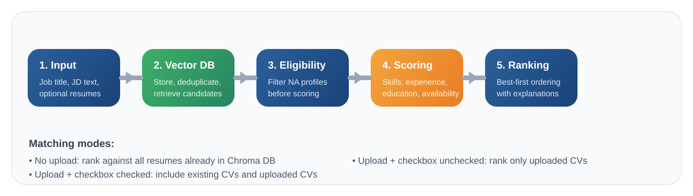

# ICRS User Guide


## 1. What Is ICRS?

ICRS, the **Intelligent Candidate Ranking System**, helps recruiters and evaluators rank candidates against a job description using a structured pipeline:

- Resume parsing
- Vector database retrieval
- Eligibility filtering
- Expert flag detection
- Multi-dimensional scoring
- Explainable ranking output

ICRS can work with:

- resumes already stored in the vector database
- newly uploaded resumes
- a combined set of stored and uploaded resumes

---

## 2. At A Glance

| Item | Description |
|---|---|
| Frontend | Browser-based UI in `SourceCode/frontend/index.html` |
| Backend API | FastAPI app in `SourceCode/main.py` |
| Default API URL | `http://localhost:8000` |
| Health Check | `GET /health` |
| Vector DB | Chroma resume store |
| Main Ranking API | `POST /api/rank` |

---

## 3. ICRS Workflow



### Pipeline Summary

1. **Input**
   Enter the job title and job description, then optionally upload resumes.

2. **Vector DB Handling**
   Uploaded resumes are parsed and checked for duplicates using file hash. Existing resumes can also be pulled from the vector database.

3. **Eligibility Filter**
   Candidates who do not meet essential criteria are marked as **Not Applicable (NA)** and excluded from scoring.

4. **Scoring**
   Eligible resumes are scored across five dimensions such as skills, experience, education, availability, and miscellaneous fit.

5. **Ranking + XAI**
   Candidates are ranked and returned with explanations, flags, dimension scores, and reasoning traces.

---

## 4. Starting The System

### Backend

From the `SourceCode` folder:

```bash
python main.py
```

The backend runs on:

```text
http://localhost:8000
```

### Health Check

Use this to confirm the API is running:

```bash
curl http://127.0.0.1:8000/health
```

Expected response includes:

- `status: healthy`
- API version
- pipeline name
- vector DB stats

---

## 5. Using The Frontend

The frontend allows a user to rank resumes directly from the browser.

### Step 1. Open The Interface

Open the frontend page in a browser from:

```text
SourceCode/frontend/index.html
```

### Step 2. Enter Job Details

Fill in:

- **Job Title**
- **Job Description**

The job description should include details such as:

- required skills
- minimum experience
- education expectation
- notice period or availability hints

### Step 3. Choose Resume Matching Mode

The upload panel supports three user flows:

#### Option A. No Upload

If you do not upload any resumes, ICRS automatically ranks against **all resumes already stored in the vector database**.

#### Option B. Upload Resumes + Keep Checkbox Checked

If resumes are uploaded and **Include existing CVs from the vector DB along with uploaded CVs** remains checked, ICRS ranks using:

- existing resumes in the vector database
- uploaded resumes from the current session

#### Option C. Upload Resumes + Uncheck Checkbox

If resumes are uploaded and the checkbox is unchecked, ICRS ranks **only the uploaded resumes**.

### Step 4. Click `Rank Candidates`

ICRS will:

- optionally store new resumes
- skip duplicates already in the vector DB
- retrieve the matching candidate set
- run ranking
- display result cards

---

## 6. Understanding The Results Screen

The result view presents ranked candidate cards and supporting explanations.

### Summary Bar

The summary panel shows:

- target position
- eligible count
- top score

### Candidate Cards

Each candidate card includes:

- rank
- candidate name
- top job title
- experience years
- education level
- notice period
- overall score

### Dimension Pills And Bars

Each eligible candidate shows scoring details such as:

- Technical Skills
- Experience
- Education
- Availability
- Miscellaneous

### ICRS Justification

Each candidate contains a short plain-language explanation summarizing:

- overall fit
- strongest dimensions
- weaker dimensions
- matched and missing skills
- major flags affecting the candidate

### KB Expert Flags

Expert flags are displayed separately to show whether the candidate triggered patterns such as:

- leadership alignment
- overqualification
- availability risk
- relocation risk
- work visa considerations

### Not Applicable Cards

If a candidate fails eligibility, ICRS displays the candidate as **N/A** with a clear reason instead of a normal scorecard.

---

## 7. Vector Database Operations

ICRS uses a Chroma-based vector database to store and retrieve resumes.

### Resume Storage Rules

- uploaded resumes are parsed before indexing
- duplicate detection uses a **file hash**
- previously stored resumes are not stored again

### Why A Resume Might Not Be Stored Again

If the resume already exists in the database, the system reports it as a duplicate and reuses the existing candidate record.

### Clearing The Vector Database

To clean the database:

```bash
curl -X POST http://127.0.0.1:8000/api/clear-db
```

Use this when you want to:

- reset the demo environment
- remove all stored resumes
- test a fresh upload cycle

---

## 8. API Quick Reference

### `GET /health`

Checks API status and vector DB stats.

```bash
curl http://127.0.0.1:8000/health
```

### `POST /api/store-resumes`

Stores uploaded resumes in the vector DB.

```bash
curl -X POST http://127.0.0.1:8000/api/store-resumes \
  -F "resumes=@resume1.pdf" \
  -F "resumes=@resume2.docx"
```

### `POST /api/rank`

Ranks candidates against a job description.

#### Rank Against All Stored Resumes

```bash
curl -X POST http://127.0.0.1:8000/api/rank \
  -F "job_title=Senior Software Engineer" \
  -F "job_description=We are looking for a Senior Software Engineer with Python, Java, system design, and leadership experience."
```

#### Rank Uploaded Resumes Only

```bash
curl -X POST http://127.0.0.1:8000/api/rank \
  -F "job_title=Senior Software Engineer" \
  -F "job_description=We are looking for a Senior Software Engineer with Python, Java, system design, and leadership experience." \
  -F "matching_mode=only_uploaded" \
  -F "resumes=@resume1.docx" \
  -F "resumes=@resume2.docx"
```

#### Rank Existing + Uploaded Resumes

```bash
curl -X POST http://127.0.0.1:8000/api/rank \
  -F "job_title=Senior Software Engineer" \
  -F "job_description=We are looking for a Senior Software Engineer with Python, Java, system design, and leadership experience." \
  -F "matching_mode=existing_plus_uploaded" \
  -F "resumes=@resume1.docx"
```

### `POST /api/parse-resume`

Parses a single uploaded resume and returns the `ParsedResume` structure.

```bash
curl -X POST http://127.0.0.1:8000/api/parse-resume \
  -F "resume=@resume1.docx"
```

Returned fields include:

- raw text
- name
- email
- phone
- skills
- experience years
- education level
- job titles
- certifications
- notice period
- career gaps
- summary

### `GET /api/weights`

Returns the category weight configuration used by the backend.

```bash
curl http://127.0.0.1:8000/api/weights
```

---

## 9. Practical User Scenarios

### Scenario 1. Recruiter Wants A Fast Ranking From Existing Resume Pool

- open the frontend
- paste the JD
- do not upload resumes
- click `Rank Candidates`

Result: ICRS ranks against all resumes already in the vector DB.

### Scenario 2. Recruiter Wants To Compare New Applicants With Existing Candidates

- upload new resumes
- keep the checkbox checked
- click `Rank Candidates`

Result: ICRS combines stored resumes and uploaded resumes.

### Scenario 3. Recruiter Wants To Evaluate Only Today’s Uploads

- upload resumes
- uncheck the existing-CV checkbox
- click `Rank Candidates`

Result: ICRS ranks only the uploaded files.

### Scenario 4. Admin Wants A Fresh Demo State

- clear the vector DB using `/api/clear-db`
- upload a clean set of resumes
- run ranking again

---

## 10. Troubleshooting

### Backend Not Running

Symptom:

- frontend shows a request error
- `curl /health` fails

Action:

```bash
python main.py
```

### No Candidates Returned

Possible reasons:

- vector DB is empty
- uploaded files were invalid or empty
- matching mode is `only_uploaded` but no files were uploaded

### Resume Marked As Duplicate

Reason:

- the same file content already exists in the vector DB

Action:

- keep the duplicate if reuse is intended
- clear the DB first if you want a fresh indexing test

### Browser Shows Old UI

Action:

- refresh the browser
- hard refresh if cached assets remain visible

---

## 11. Best Practices

- Use clear job descriptions with skills and experience requirements.
- Keep resume uploads relevant to the target role.
- Use **Only Uploaded** when performing a tightly controlled shortlisting exercise.
- Use **Existing + Uploaded** when benchmarking new applicants against an existing talent pool.
- Clear the vector DB before demos if you need predictable results.

---

## 12. Document Location

This user guide is stored in:

```text
UserGuide/ICRS_USER_GUIDE.md
```

Visual assets used by this guide are stored in:

```text
UserGuide/assets/
```